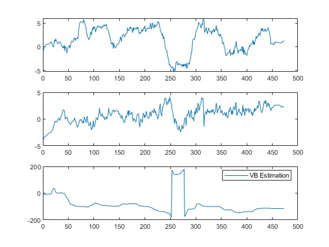
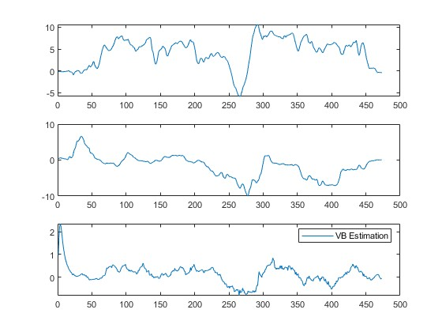
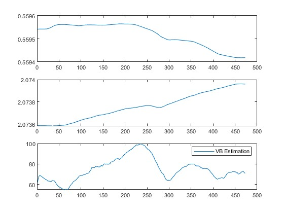
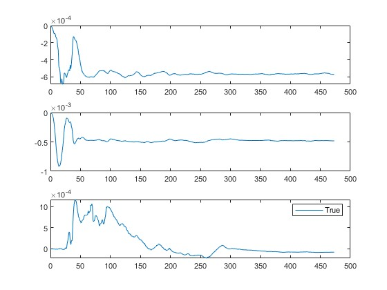
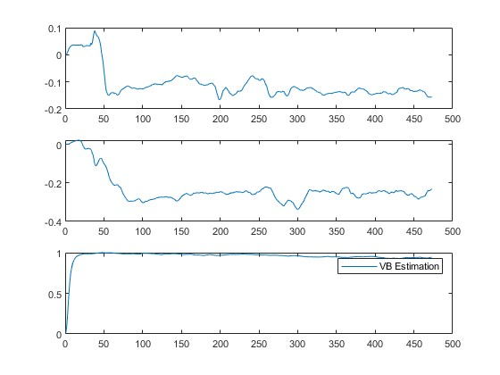
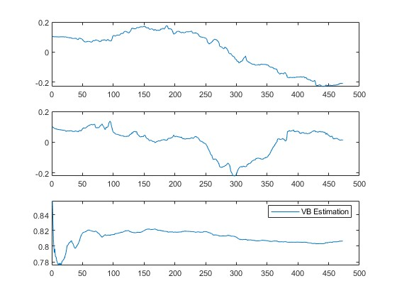
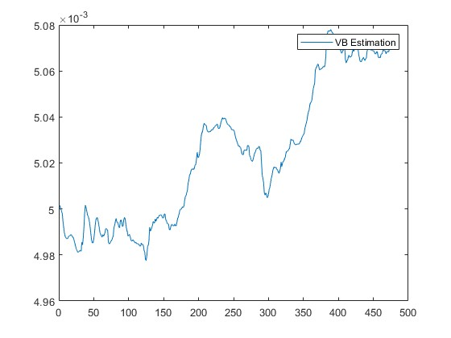
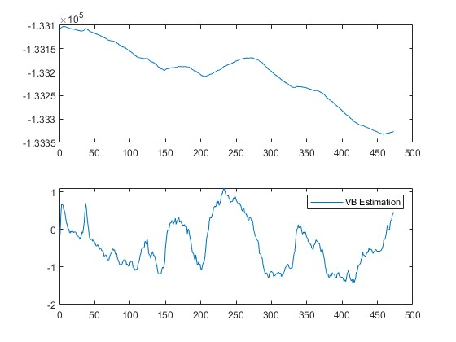
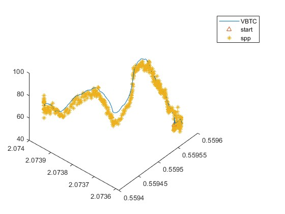
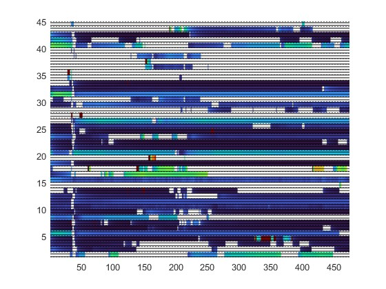

# Preface
This software is used to implement the tightly coupled navigation with GNSS system. The normal NMEA frame and UM982 gnss chip frame are supported for GNSS sensors. The 0xA5 frame header of STIM300 is supported for IMU sensor. 

The traditional fusion method with Extended Kalman filter and the novel method proposed by myself are realized in "[*./modules/INSCore*](./modules/INSCore)" with C++ and "[*./matlab/tightlyCoupleNavigation*](./matlab/tightlyCoupleNavigation)" with MATLAB. Detailed performance evaluation and algorithm principles ("[*./matlab/PrincipleVerifyByROTModel*](./matlab/PrincipleVerifyByROTModel/)") can be found in the subfolder of "[*./matlab*](./matlab)".

# How to Use
## 1 Primary configuration
	cd ./src 
	sudo -i 
	// entering the password 
	// (debian) 
	apt-get install libeigen3-dev 
	apt-get install gsl-bin libgsl-dev 

## 2 Building
	cd /LULUNAV 
	mkdir build 
	cd ./build 
	cmake .. 
	make

## 3 Running in root user
	sudo -i 
	entering the password 
	./LuNavigation

Alternative: \
You also can be running in debug mode by install the Cmake extension within VScode by https://code.visualstudio.com/

## 4 Code configuration in "[*./inc/main.hpp*](./inc/main.hpp)"
1. if you want to use the novel VB - sequential processing code please uncomment the macro "*USINGNOVELMETHOD*".
2. if you want to evaluate the time consumption please uncomment the macro "*EVALUATETIME*".
3. if you want to running the code from saved raw data please uncomment the macro "*READFROMFILE*" and specify the file path by revise the macro "*IMUSIMDATAFILE*" and "*GNSSSIMDATAFILE*". Meanwhile, the output path alse need to specify by revise the macro "*TCINSSIMLOGFILE*".
4. if your IMU frequency is not 125 Hz, please revise the macro "*GLV_IMU_SAMPLES*".
5. change the serial port macro "*IMUUARTPORT*" for IMU and "*GNSSUARTPORT*" for GNSS in real time running (if necessary).
   
## 5 Navigation configuration
please refer to the readme of the "[*./config/Readme.md*](./config/Readme.md)"

# Software framework

## Sensors information to Navigation system
like the uORB of PIXhawk framework, the publisher - subscriber pattern is used in this framework with std::thread (C++11)
## Parse sensors packets class 
template Ringbuff class to parse class for thread
## TCINS for tight couple navigation
Eigen lib is used in abstract INS class \
nested ekf class in the TCINS class for the kalman filter \
changing the tight couple navigation inital configuration in "[*./config/insEXconfig.txt*](./config/insEXconfig.txt) with key-value pair for real time experiment and "[*./config/insSIMconfigB.txt*](./config/insSIMconfigB.txt)" for post disposal.

# TODO LIST:
## 1 Factory - product pattern for TCINS
## 2 Factory - product pattern for TCNAV
## 3 Unsubscribe for the publisher - subscriber pattern
## 4 Decorator to the parse class
## 5 DMA for single core CPU
## 6 Support for linux kernel mode
## 7 EPH (ephemeris) data disposition processing for range rate measurement
## 8 Support range rate measurement for TCINS
## 9 Coarse alignment

# File Description
	|-- ..LULUNAV
	|-- .config
	|-- .data
		|-- AHRS // Reference system data
		|-- sensors // for debug mine system sensors data
		|-- SPAN // Novatel SPAN data
		|-- SIM // running output offline or simulation output
		|-- tightcouple // tightly coupled navigation data included the raw data from gnss and imu
	|-- .driver // serial driver code
	|-- .img // result images
	|-- .inc // marco define for src in current directory
	|-- .matlab // the matlab code and data for the novel method 
	|-- .modules 
		|-- .Component // the template Ringbuff class code
		|-- .INSCore // the tightly coupled navigation core code
		|-- .ParseGNSS // the parse code for um982 GNSS chip
		|-- .ParseIMU // the parse code for STIM300 IMU
	|-- .platform // the publisher - subscriber software framework pattern code
	|-- .src // the main combination code
# NOTE:
1. subscriber must be create by make_shared 
2. A initial attitude must to be config in the "[*./config/insEXconfig.txt*](./config/insEXconfig.txt)" 
3. The GNSS only support fixed 1 Hz until now
4. If you want to running the Matlab code, the psins toolbox must be applied from  https://www.psins.org.cn/
5. There are slight differences between the result of C++ and the result of Matlab.
6. A GPL license is used in mine code, commercial using is not allowed without permission
7. The corresponding work was submitted to "*IEEE Internet of Things Journal*" on 13/11/2024 with manuscript ID: IoT-43958-2024.

# Estimation Result:
## Novel method estimation result

**A comparison between other methods and SPAN (NovAtel) can be see in "[*./matlab/Readme.md*](./matlab/Readme.md)"** 

Attitude:

Velocity:

Position:

Gyroscope Bias:

Accelerometer Bias:

Lever:

Time delay:

Clock offset and clock drift:

trajectory:

R estimation:

# Acknowledgment:
Thanks Dr. Gongmin Yan's open source code psins toolbox from https://www.psins.org.cn/ in Northwestern Polytechnical University of P.R.China.

#
data: 09/11/2024 \
lu email: zhong.yulu.ll@gmail.com or yulu_zhong@seu.edu.cn
