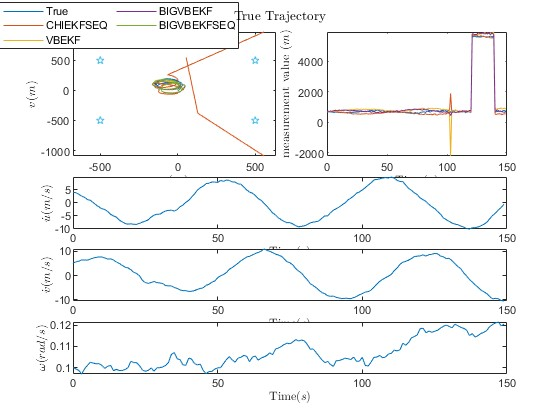
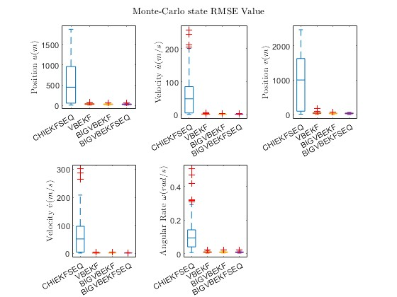

# Simulation with Matlab
## Dependency
1. Running in Matlab 2022b
2. Tightly coupled navigation depend on the psins toolbox that can be achieved by https://www.psins.org.cn/ or https://github.com/WangShanpeng/PSINS

## File Description
	|-- ..matlab
	|-- .tightlyCoupleNavigation
		|-- EX_of_MineBIVBTCNavEKF21.m // sequential tightly coupled with the novel fitler
		|-- EX_of_MineTCChiNavEKF21.m // sequential tightly coupled with Chi-square method
		|-- EX_of_MineTCNavEKF21.m // sequential tightly coupled with normal EKF
	|-- .PrincipleVerifyByROTModel
		|-- test_ln_VBEKFSEQ_DMN_4d.m // linear meausurement model with the novel filter by sequential processing
		|-- test_radar_VBSEQ_CHI_DMN_5d.m // nonlinear measurement model with the novel filter by sequential processing
	|-- ResComp
		|-- COMP21.m // a compare script for various tightly coupled navigation method estimatin result
		|-- COMPTIME // a compare script for various tightly coupled navigation method running time
		|-- *.mat // the filter result of various methods 
	|-- .img // PrincipleVerify result images
	|-- *.mat // the raw data of the tightly coupled navigation

## PrincipleVerify Result
### For linear model with sequential processing VB estimation
State:

R Estimation:

CRLB:

Iteration:

RMSE State:

RMSE R:

### For nonlinear model with sequential processing VB estimation base Bernoulli and IG distribution

State:

R Estimation:

Bernoulli Estimation:

CRLB:

Iteration:

RMSE State:

RMSE R:

## TightlyCoupleNavigation Result Comparison
Attitude:

Velocity:

Position:

